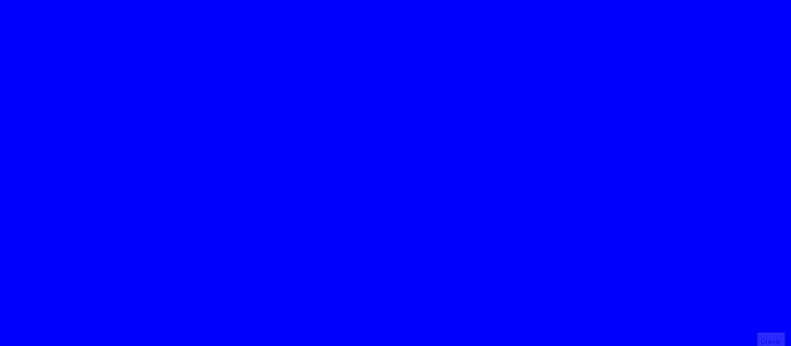

<h1 align="center">🖼<strong> Lousa Digital 🇧🇷 / Digital BlueBoard 🇺🇸 🖌</strong></h1>

<h2 align="center"><strong> Do que se trata 🇧🇷 / What it is? 🇺🇸</strong></h2>

<h2 align="center"><strong>🇧🇷</strong></h2>

Lousa Digital  Feita em HTML e JavaScript com ajuda da API Canvas que provê maneiras de desenhar gráficos via JavaScript e via elemento HTML Canvas.
 

<h2 align="center"><strong>🇺🇸</strong></h2>

Digital blueboard  Made in HTML and JavaScript with the help of the Canvas API that provides ways to draw JavaScript graphics and HTML Canvas element..
 

